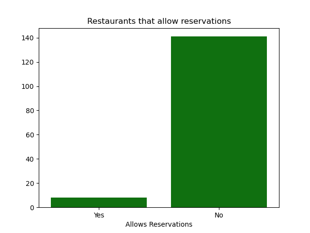

# restaurant-data-analysis-guided-project
A guided beginner data analysis project using pandas, numpy, matplotlib.pyplot, and seaborn to create tables from a csv. 
Followed from ['Geeks for Geeks: Zomato Data Analysis Using Python'](https://www.geeksforgeeks.org/data-science/zomato-data-analysis-using-python/)

## Introduction
The guided project from Geeks for Geeks was extremely helpful and informative in learning how to use **seaborn** and **matplotlib** as well as general exploratory data analysis. 
My previous experience with python was completing [Codedex's](https://www.codedex.io/): Python, Intermediate Python, NumPy, and Pandas courses. Going into this I had a low level
understanding of Data Analysis and working with data sets. I enjoyed getting to learn to format this data, comb through it, and make decisions and connections based on the data. 

## Personally Created Questions to further explore
### Pre-processing
This step was taken from the guided project to help. 
```
dataframe = pd.read_csv('Zomato-data-.csv')
def handleRate(value):
    value = str(value).split('/')
    value = value[0]
    return float(value)
dataframe['rate']=dataframe['rate'].apply(handleRate)
```
Creating a dataframe from the provided csv file, creating a function to handle the formatting of the rates from 4.5/5 to 4.5 to be worked with easier, and applying it. 
I then created, based off the handleRate function, a handleBooking function. 
```
def handleBooking(value):
    if(value == 'Yes'):
        value = 1
    elif(value == 'No'):
        value = 0
    return int(value)
dataframe['book_table']=dataframe['book_table'].apply(handleBooking)
```
I used this handleBooking function to convert the 'Yes' and 'No' from the 'book_table' column of the data frame to '1's and '0's. This made it easier for me to work on 
finding which restaurants offered reservations compared to those that do not. 

### How many restaurants allow you to book a table?
This was a simpler question I used as a jumping off point. I used matplotlib and seaborn to create a countplot base off of the 'book_table' section of my dataframe. 
I used a countplot here because it was one of the first plots I made with seaborn and matplotlib and seemed like an easy fit for this application and the next. Simply 
totaling the restaurants that do or do not allow reservations. 
<p align="center">
  
</p>
Obviously, the graph shows that the restaurants that allow reserving tables is in the minority, under even 10 restaraunts. This will greatly impact the effectiveness of 
my conclusions later because of such a small sample size. 

### What types of restaurants allow you to book a table?
Here I wanted to break down that previous graph down to only the 'Yes' section. This allows the viewers to gain a better understanding of which types of restaurants
often allow reservations. I was personally surprised that Cafes were the most common, I would have expected Dining to be the most common. However, the sample is extremely small,
about 8 elements. Additionally there may be a difference in culture as this data is from 'Zomato' which is an Indian food delivery app. 

<p align="center">
  
</p>

### Now, do restaurants that allow you to book tables have higher ratings?
Following up from the previous question, I wanted to create a graph of the restaurant types of that don't allow booking tables. This graph was to show what the rest of the restaurant breakdown looked like, primarily Dining restaurants. 
<p align="center">
    
</p>

After these graphs, I shifted my focus towards the ratings of the restaurants. I wanted to compare how allowing reservations or booking tables affected a restaurants ratings. 
I then used matplotlib and seaborn to create a box plot to show the range and median of the ratings across the different categories of the restaurants. 

<div display=flex>
  
  
</div>

Overall from these graphs, we can see that the ratings of the restaurants that accept bookings, with exception of Dining restaurants, bookings led to higher ratings in restaurants. 
However, there could be other variables that are not present in this data set that could be affecting these specific restaurants. Recall, there were only 8 restaurants in the data set
that allowed for reservations. The sample size for restaurants that allow reservations is quite small. Taking these observations with a grain of salt due to the sample size, we can see bookings
increase ratings. 
<div align="center">
  
</div>

## Final Observations
My final observations from the questions that I had made for myself was that restaurants that offer reservations of tables, on average, have higher ratings than those that do not offer reservations. 
Although there is flaw in this dataset due to the lack of samples for restaurants that offer reservations, this was an extremely fun project for me to get into data analysis. The opportunity to explore
and learn about using the **seaborn**, **matplotlib**, **numpy**, and **pandas** libraries was genuinely a fun time and I am excited to do further projects in the future!
